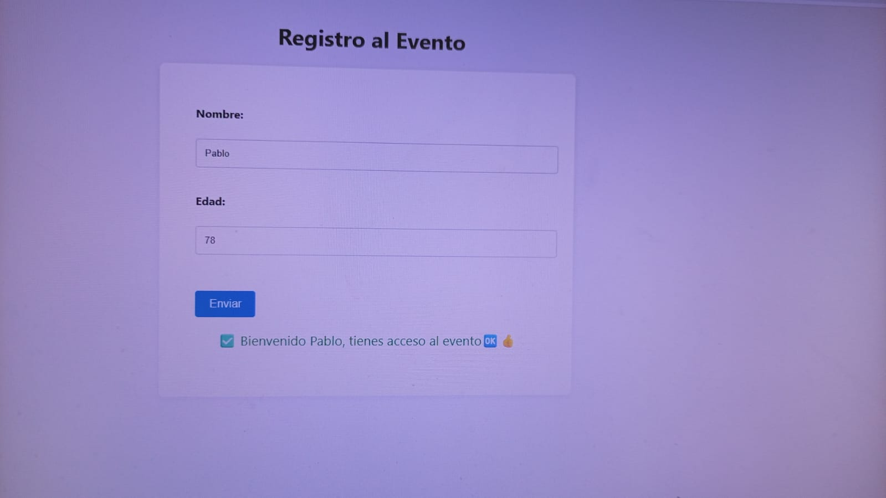
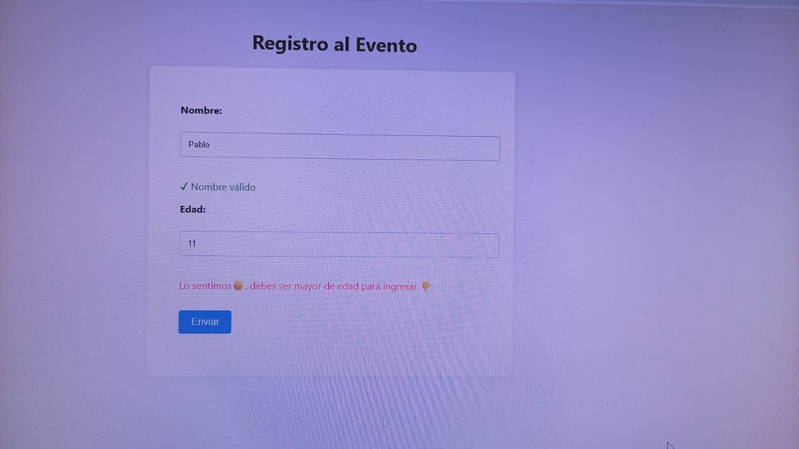
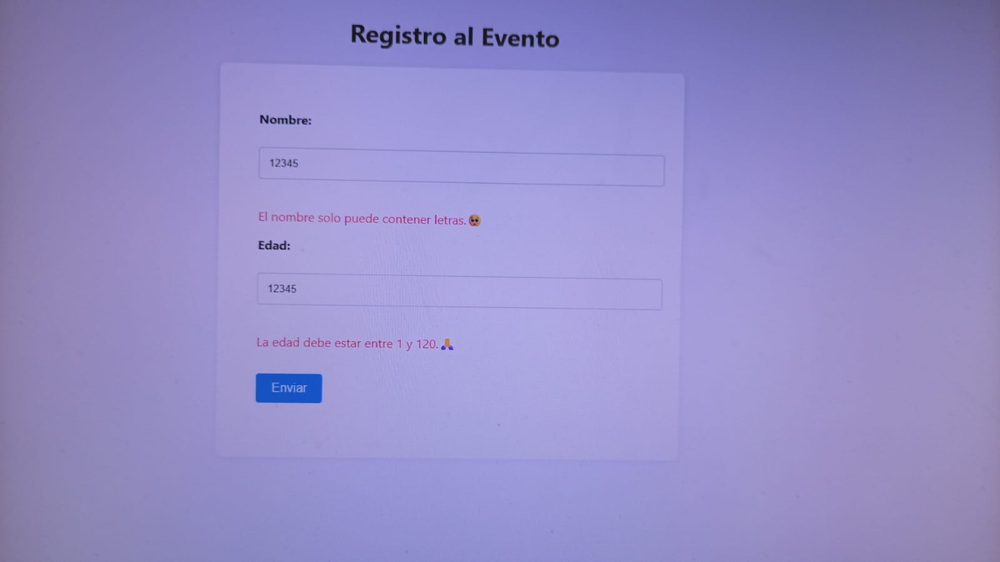
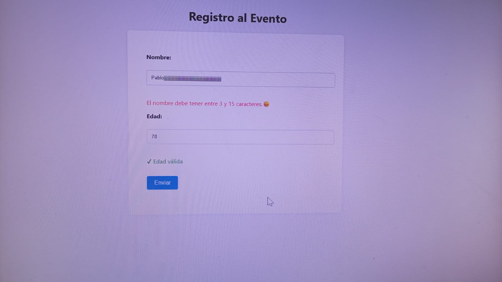
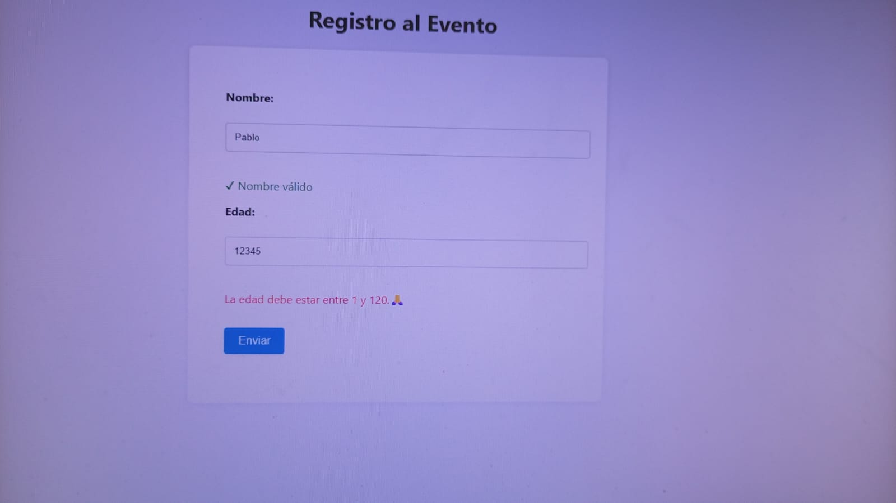
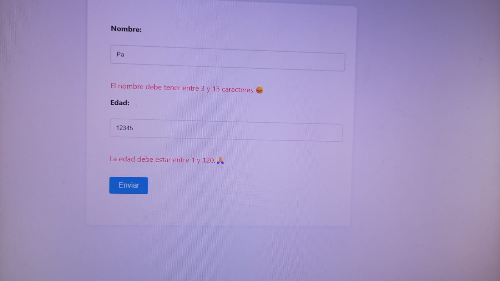

# 📋 Registro al Evento

Este proyecto es una práctica de validación de formularios en **HTML5**, **CSS3** y **JavaScript**.  
El usuario debe ingresar un **nombre válido** (solo letras, entre 3 y 15 caracteres) y una **edad válida** (entre 18 y 120 años).  
En caso de error se muestran mensajes en **rojo**, y si todo es correcto se muestra un mensaje positivo en **verde**.

---

## 🚀 Tecnologías utilizadas

- HTML5
- CSS3
- JavaScript (DOM + Validaciones)

---

## 🖼️ Capturas de pantalla

## ⚙️ Instrucciones de instalación y ejecución

## 🚀 Cómo usar el proyecto

1. Clonar o descargar este repositorio.
2. Abrir el archivo `index.html` en cualquier navegador.

Usá una extensión como Live Server en VS Code.

## 👤 Autor

Proyecto desarrollado por **Pablo Caparelli**  
📅 Año: **2025**
Diplomatura en Professional Full-Stack Developer
